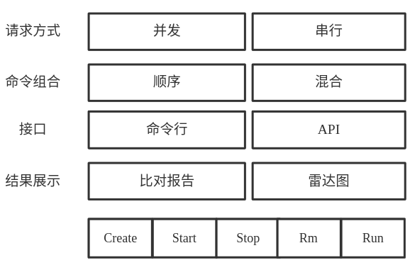

# ptcr

#### 介绍
ptcr是一个针对容器引擎的性能测试工具，可配置不同容器引擎进行(并行/串行)测试，生成测试结果及矢量图.
#### 功能简介

- 命令组合：请求命令的组合方式，以10次为例，顺序方式为Create\*10之后Start\*10、Stop\*10、Remove\*10，而混合方式为Create之后Start、Stop、Remove，连续执行10次。
#### 安装教程
1.  编译
    
    依赖：yaml-cpp
    
    mkdir build && cd build && sudo -E cmake ../ && sudo -E make -j
2.  拷贝默认配置
    cp ../configs/* ./
3.  配置说明
    log_lever     ：内部日志等级，默认ERROR
    image_name    ：执行请求使用的镜像名称，默认为busybox
    mixed_cmd     ：命令组合方式，1为混合方式，0为串行
    measure_count ：请求的次数
    runtime_names ：客户端名称
    runtime_endpoint ：使用API方式时服务端的socket路径
    start_cmd     ：运行容器时使用的命令
#### 使用说明

1.  build目录，./src/ptcr --help查看帮助， ./src/ptcr -c ./ptcr.yml执行测试
2.  结果展示：
	1) 测试完成后，测试报告如下:
	
	2) 同时生成ptcr_result.txt(可通过-o或者配置文件更改)结果文件，保存的内容为
    平均耗时，使用configs目录下的draw.py，执行pythonx draw.py ptcr_result.txt将
	此次结果生成矢量雷达图：
        

#### 参与贡献

1.  Fork 本仓库
2.  新建 Feat_xxx 分支
3.  提交代码
4.  新建 Pull Request

#### 特技

1.  使用 Readme\_XXX.md 来支持不同的语言，例如 Readme\_en.md, Readme\_zh.md
2.  Gitee 官方博客 [blog.gitee.com](https://blog.gitee.com)
3.  你可以 [https://gitee.com/explore](https://gitee.com/explore) 这个地址来了解 Gitee 上的优秀开源项目
4.  [GVP](https://gitee.com/gvp) 全称是 Gitee 最有价值开源项目，是综合评定出的优秀开源项目
5.  Gitee 官方提供的使用手册 [https://gitee.com/help](https://gitee.com/help)
6.  Gitee 封面人物是一档用来展示 Gitee 会员风采的栏目 [https://gitee.com/gitee-stars/](https://gitee.com/gitee-stars/)
